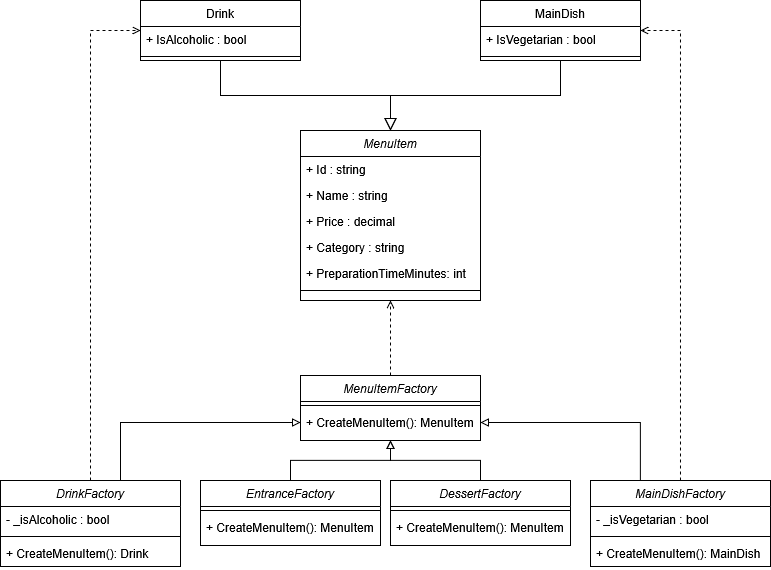
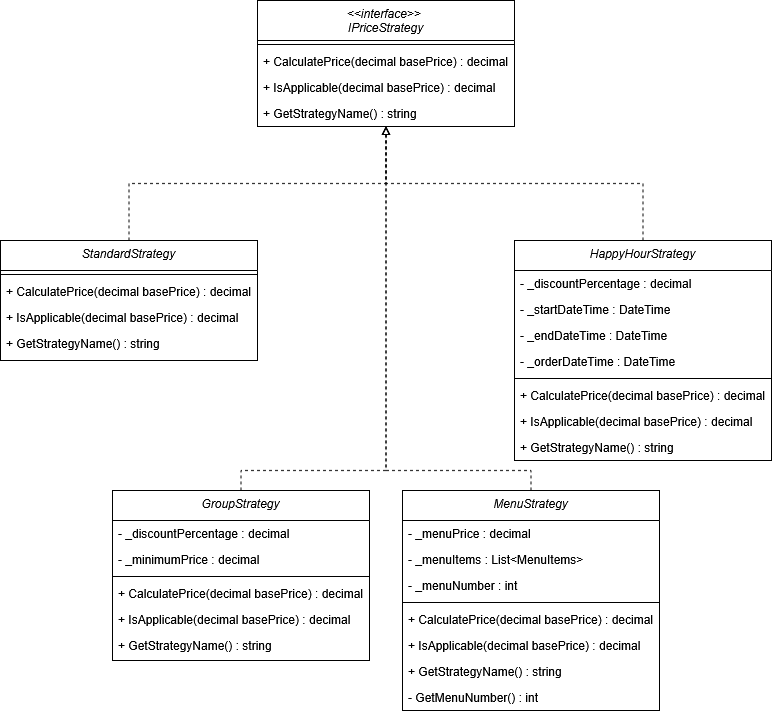

# Design Patterns - API Restaurant

Contributeur : Emeric SAUTHIER

## 🚀 Démarrage
### Prérequis
- .NET 8 SDK installé
- Un IDE C# (Visual Studio, VS Code, ou Rider)

### Lancer l'API
```bash
cd RestaurantApi
dotnet run
```

### Tester
Ouvrez votre navigateur sur l'URL affichée (généralement https://localhost:xxxx/swagger) pour accéder à l'interface Swagger.

Vous pouvez aussi utiliser le guide Postman fourni.

---

## Analyse des besoins + Patterns associés

### Besoin 1 - Gestion des types de plats

Présentation :  
4 catégories de plats (Entrée, Plats principaux, Desserts, Boissons) ayant des caractéristiques communes (nom, prix, temps de préparation, catégorie) et des caractéristiques propres (exemple pour les boissons: alcool)

Contraintes principales :  
- Création de plat facile
- Ajout de catégorie simple dans le futur
- Logique de création pas éparpillée
- Le code ignore les détails d'implémentation

Pattern retenu :  
**Factory** afin de centraliser la logique de création de plat.


### Besoin 2 - Calcul flexible du prix

Présentation :  
Plusieurs politiques de tarification (Standard, Happy Hour, Réduction groupe, Formule menu), qui dépendent de différents facteurs (montant, heure ou contenu de la commande)

Contraintes principales :  
- Choix de la tarification change dynamiquement
- Ajout de nouvelles tarifications facile
- Pas de if/else pour chaque tarification
- `Order` ne contient pas toutes les méthodes de calcul

Pattern retenu :  
**Strategy** afin de ne pas avoir beaucoup de if/else, de ne pas avoir de logique dans `Order`, et de simplifier l'application de la tarification.


### Besoin 3 - Workflow de traitement de commandes

Présentation :  
Cycle de vie d'une commande : Reçue -> En préparation -> Prête -> Servie -> Payée

Contraintes principales :  
- Transition entre états automatiques
- Comportement spécifique de chaque étape
- Une commande payée ne peut plus changer d'état

Pattern retenu :  
**State** afin de transiter entre les états de manière contrôlée et simplifiée

### Besoin 4 - Notifications inter-services

Présentation :  
Plusieurs services (Cuisine, Salle, Facturation) doivent être informés des évènements sur les commandes.

Contraintes principales :  
- `Order` ne connait pas les services
- Ajout de services facile
- Abonnement/Désabonnement des services
- Comportement spécifique des services

Pattern retenu :  
**Observer** afin de notifier les services abonnés, sans que `Order` ne connaisse leur logique, et qu'ils réagissent en fonction.

### Besoin 5 - Configuration globale du restaurant

Présentation :  
Données partagées dans toute l'application (Menu & Plats disponibles, Horaires, Paramètres globaux).

Contraintes principales :  
- Un seul point d'accès
- Une seule instance des données
- Thread-safe
- Initialisation unique au démarrage

Pattern retenu :  
**Singleton** afin de permettre l'instanciation d'une seule classe et qu'elle soit accessible dans toute l'application.